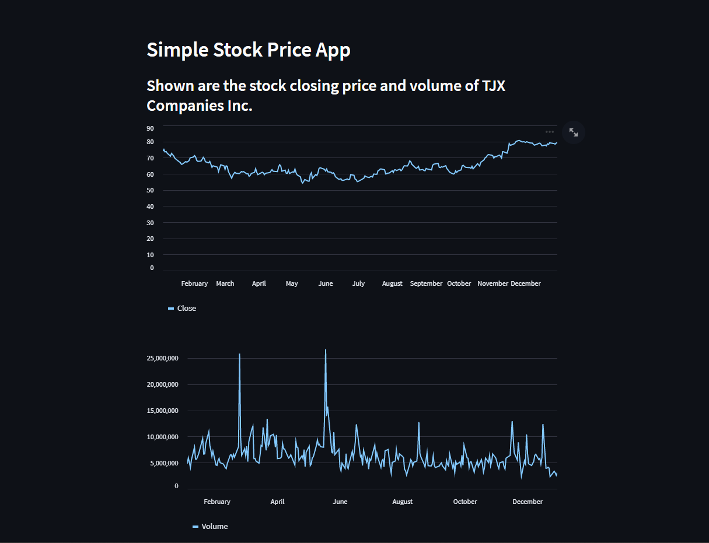

# simple_stock_price

This simple streamlit web app shows the stock price of TJX Companies Inc. for the period of 2022-01-01 to 2023-01-01 in 1 day intervals. 



This project is one of the simple projects from freecodecamp's [youtube video](https://www.youtube.com/watch?v=JwSS70SZdyM)

The app can either be run from a local machine or via the streamlit app link.

### Local Machine

The app can be run locally in a virtual environment (i.e. conda) with the following packages installed using *pip*:

- streamlit = 1.18.1
- yfinance = 0.2.12

Once the above packages are successfully installed, the app can be run with the following command in terminal:

```bash
streamlit run simple_stock_streamlit.py
```

### Streamlit App Link

I have also deployed this app on streamlit's community cloud. The app can accessed through the following link: https://simple-stock-price-ramd.streamlit.app/
